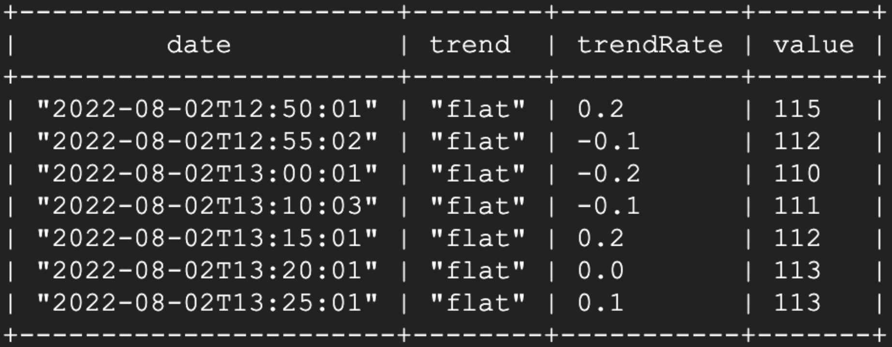
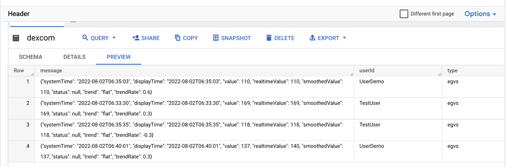
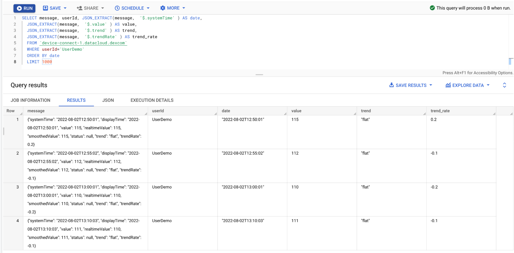

Connected Data Cloud
=====

This project is designed to simplify deployment and scaling of Connected Datacloud Devices. 

Following GCP services are used:
- Pub/Sub
- Cloud Storage
- Compute Engine
- App Engine
- Cloud Functions
- DialogFlow
- IAM

The demo will deploy dexcom cloud function to connect with Dexcom API and stream data into the BigQuery using DataFlow. 

# Overview

- This demo uses [Dexcom API](https://developer.dexcom.com/sandbox-data) to pull data from the sandbox every 15 minutes using Cloud Scheduler and CLoud Function.
- Cloud Function uses [egvs endpoint](https://developer.dexcom.com/get-egvs) and ingests data via Pub/Sub into the BigQuery `datacloud` dataset, 
`dexcom` table. 
- Retrieved data contains user's estimated glucose value (EGV), including trend and status information.

# STEPS

## Prepare Project 

### 1. Create a project with a Billing account

Created GCP project and assign Billing Account.
Note down the Project_ID.

### 2. Authorize Access
Authorize gcloud to access the Cloud Platform with Google user credentials.

```sh
gcloud auth login
```

### 3. Set env variables

Set Project ID

```shell
export PROJECT_ID=<your_project_id>
```


### 4. Deploy Dexcom CloudFunction Demo Flow

```sh
git clone https://github.com/evekhm/gcp_cloud_function.git demo
demo/bin/doit
```

### 5. Query BigTable
Check its working. If all steps completed sucessfully, data will begin appearing in BigQuery and could be queried: 

```sh
bin/query
```

Sample Output:


Alternatively, following Query could be run from the Cloud Console:

- Navigate to the Cloud Console and search for Big Query.
- Find dataset called `datacloud` and table called `dexcom`. This is data retrieved from the dexcom device using API with glucose 
monitoring activiting.

- Run following Query 
  - Replace <PROJECT_ID> with your Project ID

```shell
SELECT SELECT userId, JSON_EXTRACT(message,  '$.systemTime' ) AS date,
  JSON_EXTRACT(message,  '$.value' ) AS value,
  JSON_EXTRACT(message,  '$.trend' ) AS trend,
  JSON_EXTRACT(message,  '$.trendRate' ) AS trend_rate  
FROM `<PROJECT_ID>.datacloud.dexcom`
ORDER BY date
```



### Cleaning Up

Following command will delete previously created resources. Project itself will not be deleted.
```shell
./bin/clean
```
